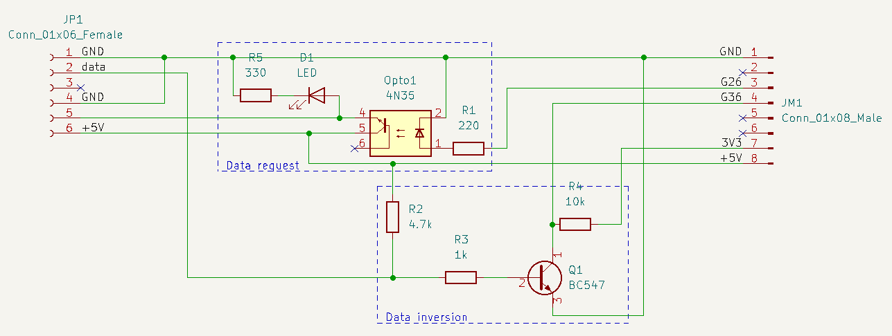
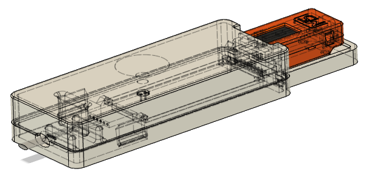

# Hardware

This page should treat any hardware considerations that where made.

## Electronics

The software library I intend to use for reading the P1 telegrams, supports switching the data request line
through a GPIO pin. 

Also, the data signal needs to be inverted and converted to 3.3V. This schema does that:

*note*: the `JP1` connector is number in reverse. This was my way of orienting the connector the right way
on the PCB.

## Casing

I designed a case that will allow me to mount the case to the meter housing and still give me easy access 
to the M5Stick when needed.

The fusion 360 design can be found here: https://a360.co/3IbdbrX

